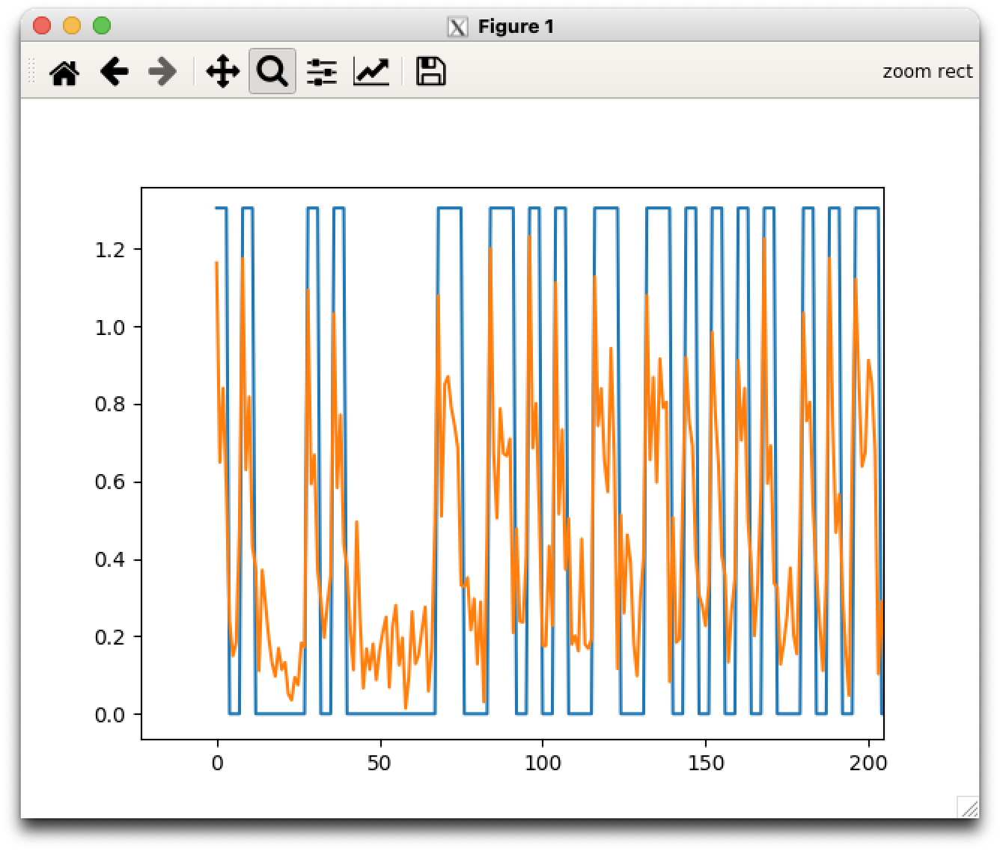

# adsb_read

Reads iq samples from an Analog Devices ADALM Pluto, a file or stdin, capturing ADS-B packets. This code is derived
from [pyModeS](https://pypi.org/project/pyModeS/) and allows sampling
at higher sample rates (via the osr option), upsampling of the original
input (for testing), saving of buffers etc.

An example of usage with the Pluto is given below. We use osr=4 so the sampling rate is 4x nominal i.e. 4*2MHz=8MHz, and specify that the output training set is written to ```/srv/breamdisk/adsb-data/x1-*```. Note that the program never overwrites files in this mode so in the example, the output is written to ```/srv/breamdisk/adsb-data/x1-1700-tdata.bin``` because that was the first new file name. The numbered outputs show the ADS-B messages received.

``` bash
$ ./adsb_read.py --osr 4 -v -t /srv/breamdisk/adsb-data/x1
sample rate: 8000000.0
0 : 20100120E3DAF4 B1348B
1 : 284844283BB1D1 BA9C8B
Writing training file to /srv/breamdisk/adsb-data/x1-1700-tdata.bin
2 : 582BA19BFDE456 2BA19B
3 : 20000122F3DAF4 7C6C80
4 : 20000522CBECF4 7C6C80
Writing training file to /srv/breamdisk/adsb-data/x1-1701-tdata.bin
5 : 284108082C3366 FB7BD7
6 : 24040722D3DAD4 E0E5E8
7 : 20000122F3DAF4 7C6C80
Writing training file to /srv/breamdisk/adsb-data/x1-1702-tdata.bin
8 : 20000122F3DAF4 7C6C80
9 : 280008082C0822 7C6C80
```

An example of how to read the data is available in ```scripts/gentset.py```.

```bash
$ scripts/gentset.py
...
file: /srv/breamdisk/adsb-data/x1-1700-tdata.bin 2 11269
2021-07-05 15:51:20.880429
             Message: 20100120E3DAF4 
        ICAO address: B1348B 
     Downlink Format: 4 

2021-07-05 15:51:27.794353
             Message: 284844283BB1D1 
        ICAO address: BA9C8B 
     Downlink Format: 5 
...
2021-07-05 16:11:02.323771
             Message: 8D7C6CA0582155E8485A5E85313D 
        ICAO address: 7C6CA0 
     Downlink Format: 17 
            Protocol: Mode-S Extended Squitter (ADS-B) 
                Type: Airborne position (with barometric altitude) 
          CPR format: Odd 
        CPR Latitude: 0.476837158203125 
       CPR Longitude: 0.1764984130859375 
            Altitude: 5525 feet

Total records= 11693 verified= 11659
Total file size 206.787667M
```

If you set the verbosity to 4 or more (```$ ./gentset.py -vvvv```), a plot of the waveforms as illustrated below is given.


Try ```python adsb_read.py -h``` to see all the options.
To understand how to use the program take a look at the Makefile. 

