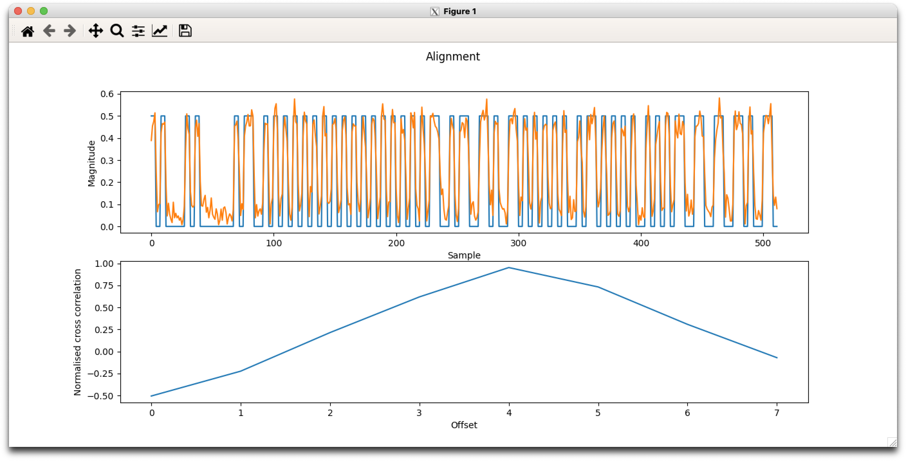

# adsb_read

Reads iq samples from Pluto, a file or stdin, capturing ADS-B packets. This code is derived
from [pyModeS](https://pypi.org/project/pyModeS/) and allows sampling
at higher sample rates (via the osr option), upsampling of the original
input (for testing) and saving of buffers.



To run just look at the Makefile (or type "make run").

``` bash
$ ../sdr/rx_tools/rx_sdr -d rtlsdr -f 1090000000 -s 2000000 - |python iqreader.py - -o x
Found Rafael Micro R820T tuner
[INFO] Opening Generic RTL2832U OEM :: 00000001...
Found Rafael Micro R820T tuner
Using device R820T: index=0 origin=https://github.com/pothosware/SoapyRTLSDR 
Found 1 channel(s) :
Channel 0 :
  Found 1 antenna(s): RX 
  Found 1 gain(s): TUNER 
  Found 2 frequencies: RF CORR 
  Found 10 sample rates: 250000 1024000 1536000 1792000 1920000 2048000 2160000 2560000 2880000 3200000 
  Found 0 bandwidths: 
Using output format: CU8 (input format CS16, 4 bytes per element)
Exact sample rate is: 2000000.052982 Hz
[R82XX] PLL not locked!
Sampling at 2000000 S/s.
Tuned to 1090000000 Hz.
Tuner gain semi-automatically set to 40 dB
[INFO] Using format CS16.
Reading samples in sync mode...
OOOOOOOOOOOOOOOOOOOOOOOOOOOOOOOOOOOOOOOOOOOOOOOOOOOOOO1 : 8D7C39F7F82300020049B866FDC4 7C39F7 0
2 : 2000023D1ED993 7C39F7
3 : A000023D82778719608C6976A7AC 7C39F7
4 : 2000023D1ED993 7C39F7
OOOOOOOOOOOOOO5 : A0010230B5B98B13BEC79AED2487 AFE683
6 : A8001B3A809800320C0000F3ECEA 7C39F7
7 : A8001B3AFF576F187FD46688680C 7C39F7
8 : 8D7C39F75813017AE124486AE97A 7C39F7 0
OOOOOOOOOOOOOOOOOOOOOOOOOOOOOO^CSignal caught, exiting!
```

```data/x-iqindex.txt``` is an example of an index file with contents:
```
(x-1.iq,2021-06-29 17:30:34.286561,0.00793687250930816)
(x-2.iq,2021-06-29 17:30:34.391115,0.00793687250930816)
(x-3.iq,2021-06-29 17:30:34.630880,0.00793687250930816)
(x-4.iq,2021-06-29 17:30:34.720284,0.00793687250930816)
(x-5.iq,2021-06-29 17:30:50.081858,0.00793687250930816)
(x-6.iq,2021-06-29 17:30:50.174330,0.00793687250930816)
(x-7.iq,2021-06-29 17:30:50.249017,0.00793687250930816)
(x-8.iq,2021-06-29 17:30:50.338001,0.00793687250930816)
```
Each row contains (file name, time stamp, noise_floor). The files are 
.iq files but to avoid confusing temporary files with archived ones,
I've added the suffix .raw. Those files can also be seen in the
```data``` directory.

You can decode it using
```
$ python iqreader.py data/x-1.iq.raw
1 : 8D7C39F7F82300020049B866FDC4 7C39F7 0
2 : 2000023D1ED993 7C39F7
3 : A000023D82778719608C6976A7AC 7C39F7
4 : 2000023D1ED993 7C39F7
```

Try 'python iqreader.py -h' to see all the options.
